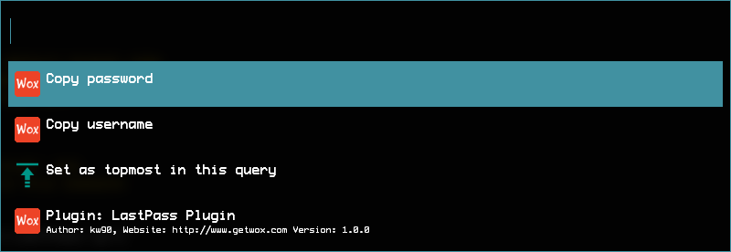

# LastPass WSL Plugin for the WOX Launcher

Provides a means to access the [LastPass CLI](https://github.com/lastpass/lastpass-cli) running inside WSL from the [WOX launcher](https://github.com/Wox-launcher/Wox).

## Requirements
- WSL
- `lpass` inside default WSL distro

## Usage

Use the keyword `lp` to start your search

## What works
- Simple search through vault with multiple keyword parts
- Copy username
- Copy password

## Open Points
- Improve search to combine groups, names and usernames
- Display username for each entry in search
- (Re-)Login to `lpass` using the Powershell after login has expired
- Copy from other fields of non-password LastPass entries
